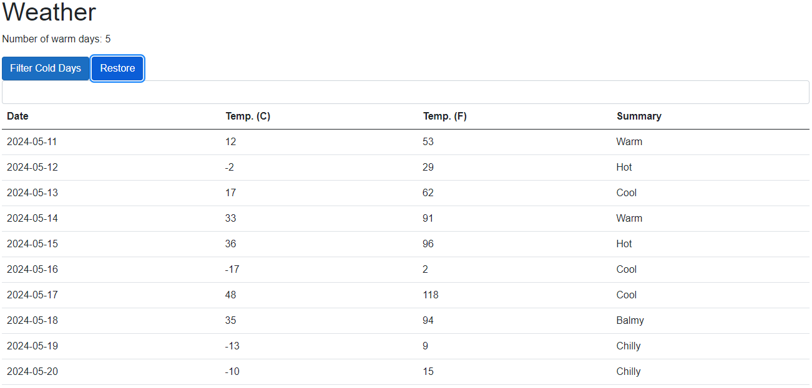
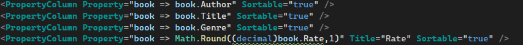

# BlazerWebApp

Autor: Krzysztof Maciejończyk

Drzewo projektu:

Opis programu:

Repozytorium podzielone jest na dwa projekty. Jeden z nich zawiera podstawową wersję Blazor Web App (**BlazerWebApp** - pierwszy projekt (zadanie 1)) z klasą Weather, rozwiniętą o dodatkowe możliwości, takie jak wyfiltrowanie zimnych dni z tabeli, wypisanie liczby ciepłych dni, czy filtracja w polu tekstowym. Poniżej przedstawiono fragmenty kodu oraz zrzuty ekranów poszczególnych funkcjonalności strony.

Aplikacja webowa

Kod HTML

Kod modyfikacji

Filtracja zimnych dni

Filtracja polem tekstowym

Powrót do oryginalnej tabelki

Drugi projekt to strona internetowa w postaci biblioteki książek (**Reviews** - drugi projekt (zadanie 2 i 3)). W celu dostania się do bazy danych użytkownik musi na początku się zarejestrować, a następnie zalogować, ponieważ opcja wyswietlenia biblioteki książek jest blokowana bez autoryzacji. Po zalogowaniu zakładka Books wyświetla książki oraz ich ogólne informacje. Dodatkowo utworzono stronę internetową na platformie Azure która miała jednak problem z łączeniem się z lokalną bazą danych. Poniżej przedstawiono zrzuty ekranu z poszczególnych funkcjonalności programu:

Kod modyfikacji oceny książki

Kod wyświetlania zdjęcia

Kod modyfikacji przez użytkownika oceny książki z ograniczeniami w tworzeniu lub edycji książki

Kod umożliwiający sortowanie po kolumnach

Klasa dla bazy danych

Aplikacja webowa

Okno rejestracji użytkownika

Okno logowania użytkownika

Tabela książek użytkownika (opcja dostępna dopiero po zalogowaniu)

Profil użytkownika (opcja dostępna dopiero po zalogowaniu)

Okno utworzenia nowego rekordu w bazie danych z książkami

Okno edycji danych książki

Możliwość modyfikacji oceny książki

Zdjęcie okładki książki (przechowywanie url zdjęcia)

Okno usunięcia książki

